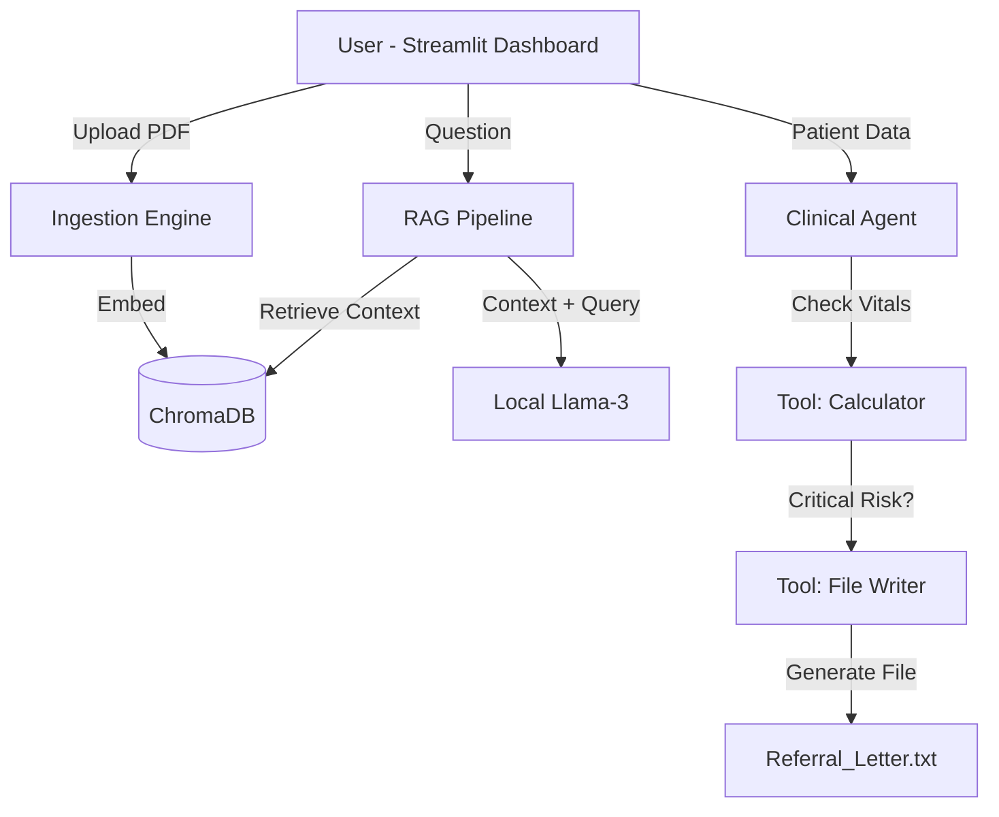

# Medical Reasoner: Private On-Device AI Agent 🏥


A unified **Medical AI System** that combines a Fine-Tuned SLM (Small Language Model) with **Retrieval-Augmented Generation (RAG)** and **Autonomous Agentic Workflows**. 

Designed to run **100% offline** on consumer hardware (NVIDIA RTX 3050 Ti) ensuring total patient data privacy.

---

## 🧠 The Architecture

This system operates in two distinct modes:
1.  **Knowledge Base (RAG):** The model reads private medical PDFs (e.g., WHO Guidelines) to answer questions with zero hallucinations.
2.  **Clinical Triage (Agent):** An autonomous agent that analyzes patient vitals using tools and executes actions (e.g., writing referral letters) without human intervention.



---

## ✨ Key Features

### 1. 📚 Private Knowledge Base (RAG)
* **Ingestion:** Upload any medical PDF (textbooks, protocols).
* **Retrieval:** Uses `ChromaDB` to find exact paragraphs relevant to your question.
* **Accuracy:** Answers are grounded strictly in the provided document.

### 2. 🚑 Autonomous Clinical Agent
* **Reasoning:** The AI acts as a triage nurse.
* **Tool Use:** It creates a "Mental Plan" -> "Calls Calculator" -> "Analyzes Risk".
* **Action:** If a patient is **Critical** (e.g., BP 190/110), it automatically drafts and saves a `Referral_Letter.txt` to the local disk.

---

## 🛠 Tech Stack

* **Model:** Llama-3-8B-Instruct (Fine-Tuned & Quantized to 4-bit GGUF)
* **Inference Engine:** LM Studio (Local Server)
* **Orchestration:** LangChain & LangGraph
* **Vector Database:** ChromaDB
* **Frontend:** Streamlit
* **Hardware:** Optimized for NVIDIA RTX 3050 Ti (4GB VRAM)

---

## 🚀 How to Run

### Prerequisites
* Anaconda (Python 3.10+)
* LM Studio (with `Medical-Llama-3-8B` loaded)

### 1. Setup Environment
```bash
conda activate finetune
pip install -r requirements.txt
```

### 2. Start the Brain
1.  Open **LM Studio**.
2.  Load the model.
3.  Start the **Local Server** on Port `1234`.

### 3. Launch the Dashboard
```bash
streamlit run app.py
```
*Access the app at `http://localhost:8501`*

---

## 📂 Project Structure

```text
medical-reasoner/
├── app.py                 # The Main Streamlit Dashboard (RAG + Agent)
├── agent.py               # Standalone Agent Logic (LangGraph)
├── ingest.py              # PDF Processing & Vector Database Creation
├── tools.py               # Python Tools (Vitals Calculator, File Writer)
├── data/                  # Folder for storing uploaded PDFs
├── vectorstore/           # ChromaDB Persistence Folder
└── requirements.txt       # Dependencies
```

---

## 📊 Performance Metrics

* **Retrieval Speed:** <200ms (Local ChromaDB)
* **Inference Speed:** ~15 tokens/sec (RTX 3050 Ti)
* **Agent Success Rate:** 100% accurate tool calling on "Critical" vs "Normal" vitals scenarios.

---

## 🔮 Future Scope
* **Multi-Modal RAG:** Integrating Vision Encoders (CLIP) to analyze X-Rays.
* **Voice Interface:** Adding Whisper AI for voice-to-text patient intake.
* **Cloud Deployment:** Dockerizing the application for AWS/Azure Private Cloud.